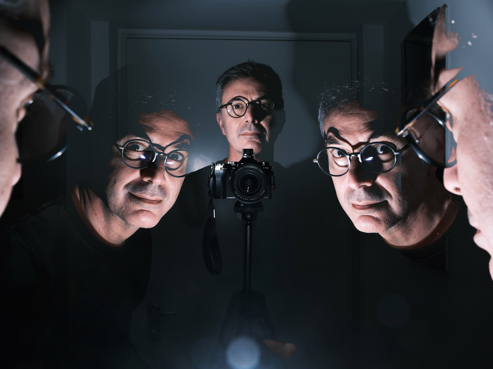
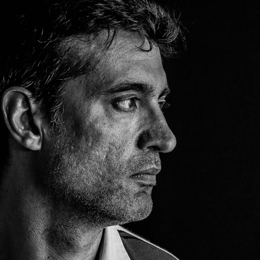
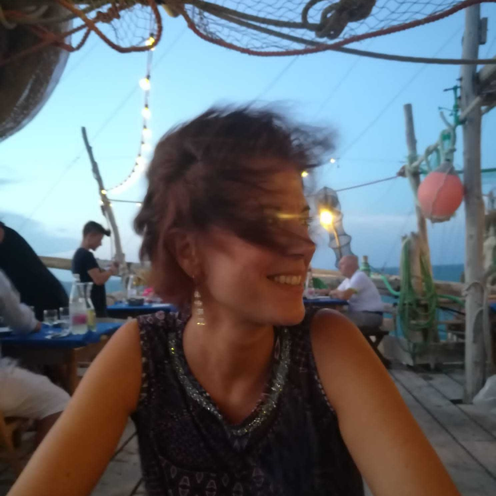
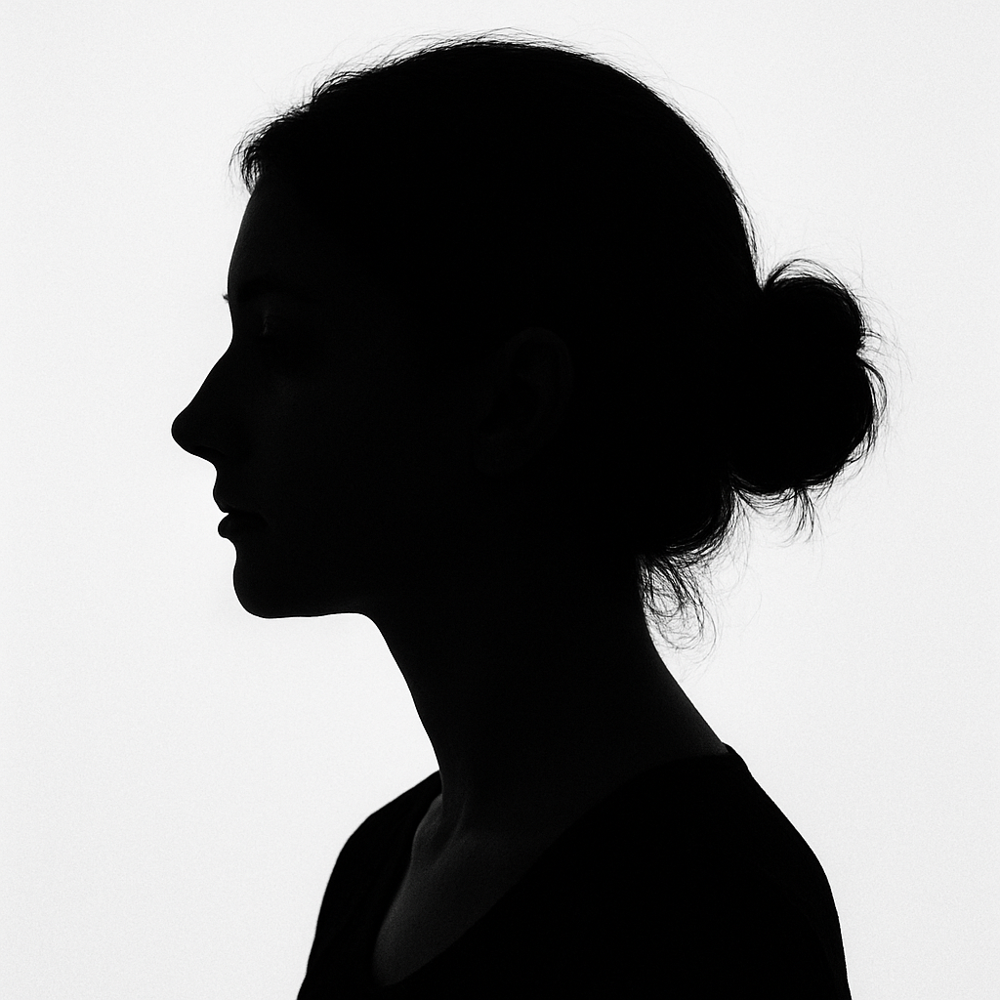
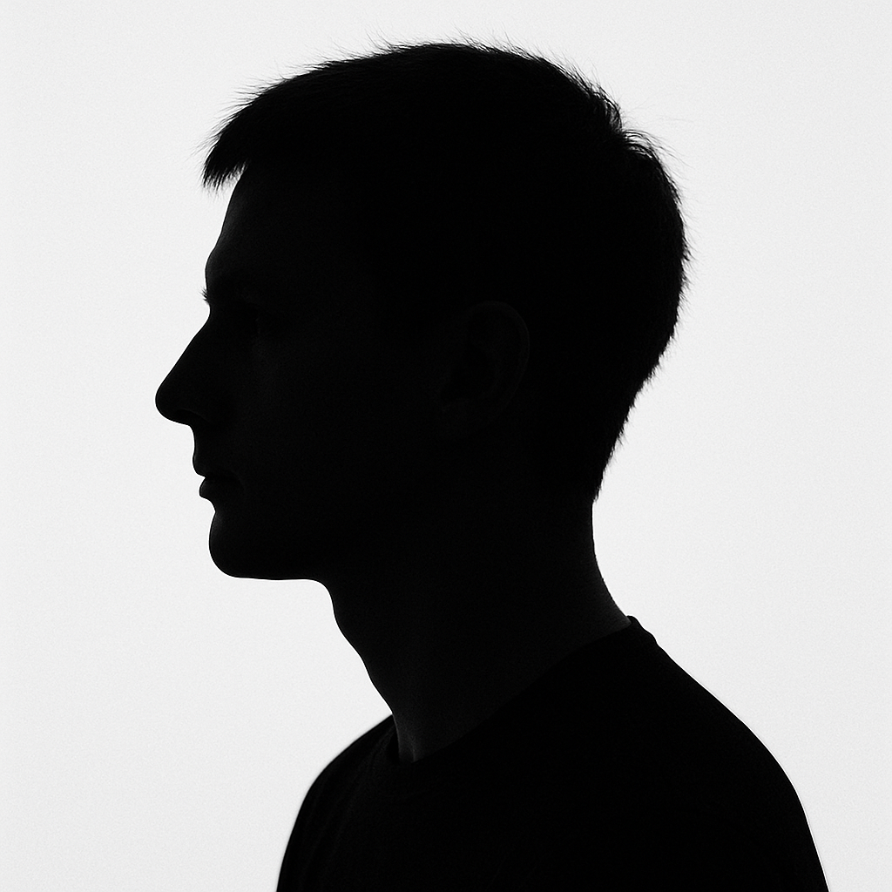

:::{.callout-warning}
Questa pagina è in costruzione!
:::

Il Consiglio direttivo (CD) dell'Associazione Witness Journal APS è attualmente composto da 9 membri, eletti dall'assemblea dei soci del 30 Aprile 2025 per il triennio 2025-2028.

Il CD si riunisce periodicamente, tipicamente il **primo lunedì del mese**, per discutere e prendere decisioni sulle questioni relative all'associazione.

Le riunioni sono aperte a tutti i soci, che possono partecipare e contribuire alle discussioni, previa richiesta di partecipazione come uditori. La richiesta va indirizzata a [direttivo\@witnessjournal.com](mailto:direttivo@witnessjournal.com){.email} almeno 48 ore prima della riunione.

::: {.callout-note title="Attenzione!"}
L'indirizzo [direttivo\@witnessjournal.com](mailto:direttivo@witnessjournal.com){.email} accetta esclusivamente email provenienti da indirizzi @witnessjournal.com.
:::

# Componenti

Il Consiglio direttivo è composto da:

### Giulio Di Meo {.wj-odd}
::: wj-details
 Presidente |  [e-mail](mailto:giulio.dimeo@witnessjournal.com) |  [@giuliodimeo](https://www.instagram.com/giuliodimeo/)

:::

Ruvianese DOCG (CE), sono un fotografo impegnato da più di dieci anni nell'ambito del reportage e della didattica. Organizzo incontri e workshop di reportage e di street photography, in Italia e all'estero, e laboratori per bambini, adolescenti, immigrati e disabili per promuovere la fotografia come strumento di espressione e integrazione. Fotografo freelance, collaboro con diverse associazioni e ONG, in particolar modo con l'Arci.

::: wj-clear
:::

### Paolo Bosetti {.wj-even}
::: wj-details
 Vicepresidente |  [e-mail](paolo.bosetti@witnessjournal.com) |   [@p4010](https://www.instagram.com/p4010/)

:::

Trentino di Trento. Sono docente universitario e fotografo per passione. Sono tra i fondatori del gruppo territoriale WJ di Trento.

::: wj-clear
:::

### Lorenzo Perone {.wj-odd}
::: wj-details
 Tesoriere |  [e-mail](mailto:lorenzo.perone@witnessjournal.com) |   [@lorenzo_perone](https://www.instagram.com/lorenzo_perone/)

:::

Sono appassionato di fotografia fin dall'adolescenza, per molti anni di ritratto e poi, folgorato sulla via di Damasco da Giulio Di Meo, mi sono appassionato ai reportage e alla fotografia sociale. Sono incuriosito ed attratto da ogni nuova tecnologia che intercetto e, qualche volta, riesco anche a farci qualcosa di utile.

::: wj-clear
:::

### Ilaria De Marinis {.wj-even}
::: wj-details
 Segretaria |  [e-mail](mailto:ilaria.demarinis@witnessjournal.com) |   [@sparkling77](https://www.instagram.com/sparkling77/)

:::

Sono nata a Roma e vivo a Bologna da Ottobre 2021. Dopo aver iniziato con una timida compatta regalata da mia sorella dopo il suo viaggio a Tokyo, mi sono avvicinata sempre di più a questo splendido mondo. Sono fortemente attratta dai reportage fotografici e dalla espressività visiva delle emozioni e delle situazioni umane. 

::: wj-clear
:::

### Lidia Addesa {.wj-odd}
::: wj-details
 Consigliere |  [e-mail](mailto:lidia.addesa@witnessjournal.com)

:::

::: wj-clear
:::

### Matilde Castagna {.wj-even}
::: wj-details
 Consigliere |  [e-mail](mailto:matilde.castagna@witnessjournal.com) |   [@matiblu](https://www.instagram.com/matiblu/)

:::

::: wj-clear
:::

### Erika Cresti {.wj-odd}
::: wj-details
 Consigliere |  [e-mail](mailto:erika.cresti@witnessjournal.com)

:::

Pratese di nascita, ma fiorentina d'adozione. Appassionata di fotografia e curiosa di natura, cerco di approfondire questo interesse mediante la partecipazione a corsi, workshop di street photography e  reportage e con l'immancabile, quanto essenziale, "scrittura con la luce"! Affascinata dal mondo di WJ, cerco di dare il mio contributo in questa nuova e bella avventura associativa con la voglia di crescere e imparare a raccontare storie attraverso le immagini.

::: wj-clear
:::

### Stefano Pontiggia {.wj-even}
::: wj-details
 Consigliere |  [e-mail](mailto:stefano.pontiggia@witnessjournal.com) |   [@stpontiggia](https://www.instagram.com/stpontiggia/)

:::

::: wj-clear
:::

### Sarah Taranto {.wj-odd}
::: wj-details
 Consigliere |  [e-mail](mailto:sarah.taranto@witnessjournal.com) |   [@sarah.taranto](https://www.instagram.com/sarah.taranto/)

:::

::: wj-clear
:::

